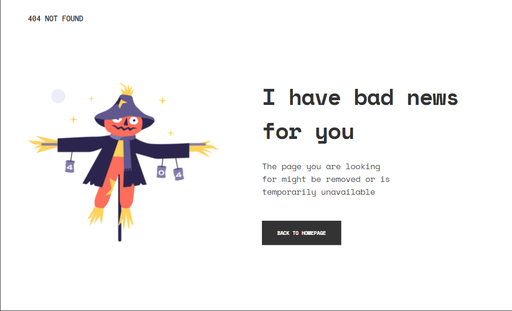

<!-- Please update value in the {}  -->

<h1 align="center">404 not found</h1>

   Solution for a challenge from  <a href="http://devchallenges.io" target="_blank">Devchallenges.io</a>.

  <h3>
    <a href="https://leonardoyz.github.io/404-page-challenge/">
      Demo
    </a>
     | 
    <a href="https://devchallenges.io/solutions/0xQwbftHMGDJTiUKMwcW">
      Solution
    </a>
     | 
    <a href="https://devchallenges.io/challenges/wBunSb7FPrIepJZAg0sY">
      Challenge
    </a>
  </h3>

<!-- OVERVIEW -->

## Overview

#

#

## Contact

- GitHub [@LeonardoYz](https://github.com/LeonardoYz)
